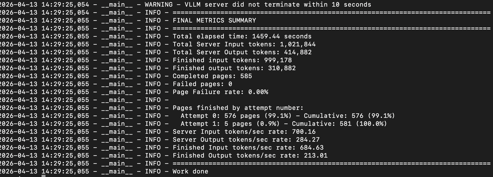
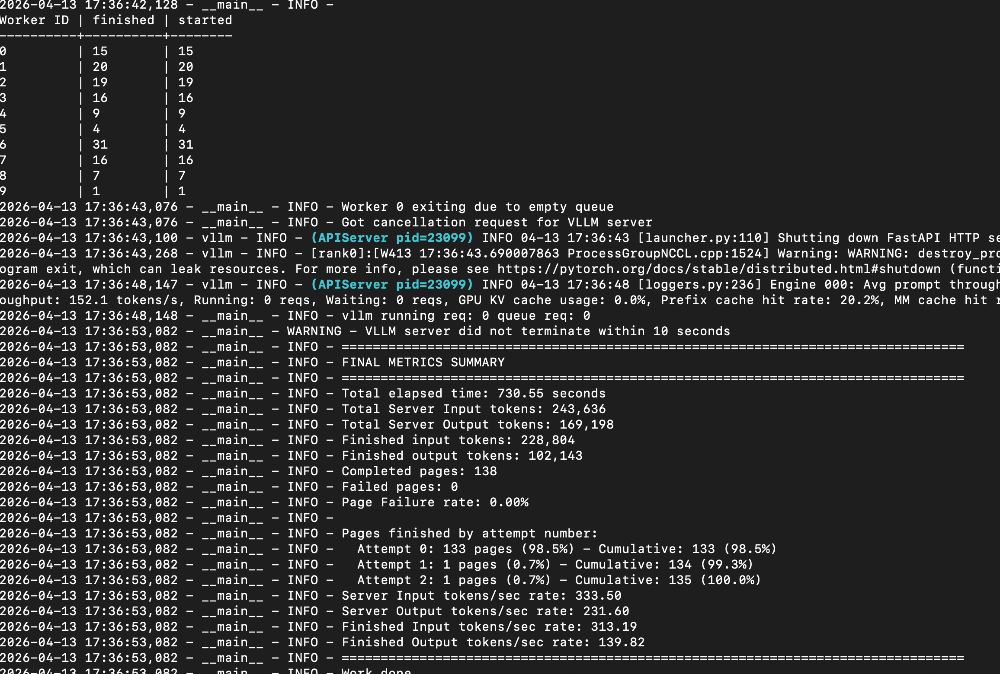
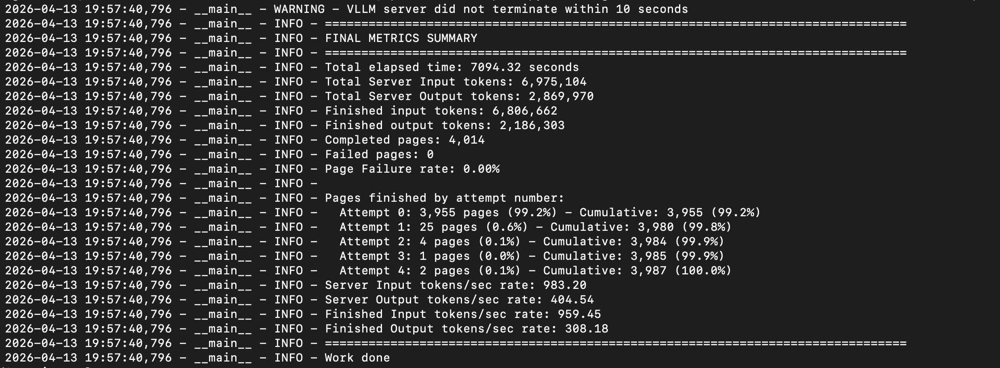

# Notes on Hyak olmocr pipeline testing

## Testing using l40-s
- Try 1: Broke without specifying the TRANSFOMERS_CACHE and HF_HOME, so TRANSFORMERS_CACHE isn't quite removed yet despite their message that it is deprecated. Maybe something else went wrong, but for now it consistently works with specifying both HF_HOME and TRANSFOMERS_CACHE so will leave as is. 
- Try 2: 
    - Processing one small pdf index card annie_harris.pdf
    - Start time: 2026-04-13 13:14:27
    - End Time: 2026-04-13 13:18:09
    - Run time: ~ 3.5 mins 
- Try 3: 
    - Run ten small docs through 
    - command: python3 -m olmocr.pipeline ten_small_pdf_workspace --markdown --pdfs ten_small_pdfs/*.pdf
    - Start time: 2026-04-13 13:25:40
    - End time: 2026-04-13 13:27:20,859
    - Run time: ~ 100 seconds 
    - looks to have used only one worker 
- Try 4: 
    - Run ten bigger docs through: 138 pages total 
    - Start time: 13:29:42
    - End time:  13:39:33
    - Run time: ~ 10 minutes 

- Try 5: 
    - Send 41 pdfs (585 pages through)
    - elapsed time 

- Try 6: 
    - Send all pages I've downloaded through 305 pdfs. This was with l40s gpu. ~4000 pages. 
    - This timed out of the 2 hour request before it finished
    - Learned that each worker has to finish its batch of files for it to be flushed to disk so trying in next run to adjust pages_per_group argument rather than it being assigned by the pipeline

- Try 7 
    - New compute node. 
    - Testing a batch of ~140 pages on a new node. 
    - 

- Try 8 
    - Testing all the docs again (~4000 pages), but this time with longer run window and forcing intermediate saves by running  python3 -m olmocr.pipeline intermediate_save_workspace --pdfs example_pdfs/*.pdf --markdown  **--pages_per_group 20**
    - outputs in intermediate_save_workspace/example_pdfs/
    - 

## Main takeaways: 
- Need to include intermediate saves in case of time outs or bottlenecks or crashes (of any variety). Without specifying pages per group the workers seem to bite off much larger chunks (100 to 700 pages) and the GPU KV cache usage gets too close to 100%. This appeared to slow down the processing (although I'm not 100% sure since the intermediate status print outs aren't perfectly clear) I think I can go larger than 20 though as the max I saw was in the low 40s for usage on the final run. The .md and .jsonl files only actually get written after a batch of files from a worker is finished. 
- It appears the TRANSFOMERS_CACHE setting is still needed. Doesn't seem to hurt anything, so leaving for now. 
- Runtimes seem quite reasonable for the scale we're going to be working at. 

## Next Steps: 
- Write script for uploading files, processing, downloading outputs, and deleting files. 
- Do we need more examples for testing purposes?
